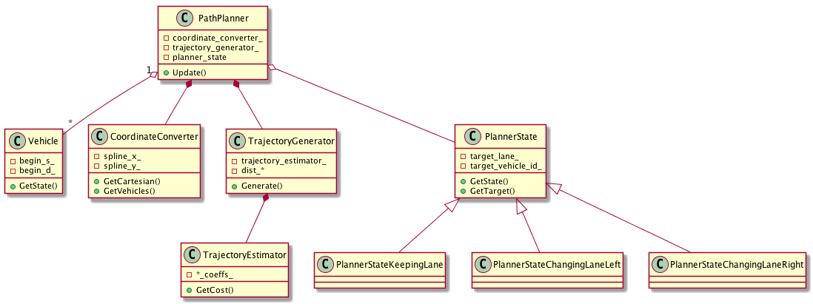
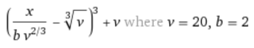
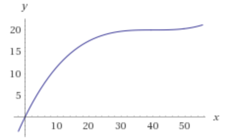

# Path Planning Project

The goals / steps of this project are the following:

* Implement the Path Planning algorithm in C++.
* Ensure that the project compiles.
* Test the Path Planner with the [simulator](https://github.com/udacity/self-driving-car-sim/releases).

## [Rubric](https://review.udacity.com/#!/rubrics/1020/view) Points
### Here I will consider the rubric points individually and describe how I addressed each point in my implementation.

---
### Compilation
#### 1. The code compiles correctly.

The code compiles without errors with cmake-3.9.0 and make-3.81 on macOS-10.12.6.

---
### Valid Trajectories
#### 1. The car is able to drive at least 4.32 miles without incident.

The car drove three laps (more than 13 miles) without an incident. See the recording below.

#### 2. The car drives according to the speed limit.

The speed limit is never exceeded. The car drived 5 mph below the posted speed limit unless there is slow trafic ahead.

#### 3. Max Acceleration and Jerk are not Exceeded.

The car does not exceed a total acceleration of 10 m/s^2 and a jerk of 10 m/s^3.

#### 4. Car does not have collisions.

The car does not come into contact with any of the other cars on the road.

#### 5. The car stays in its lane, except for the time between changing lanes.

Typically the car doesn't spend more than 2 seconds outside the lane lanes when changing lanes.

#### 6. The car is able to change lanes.

The car is able to smoothly change lanes when it makes sense to do so, such as when behind a slower moving car and an adjacent lane is clear of other traffic.

### Reflection
#### 1. There is a reflection on how to generate paths.

The class diagram of the solution: <p align="center"></p>

_**Path Planner**_

Implements the core functionality of Path Planner. It uses the Vehicle class, embeds Coordinate Converter and Trajectory Generator, and also aggregates Planner State. The only public method provided by this class is `Update`, which receives simulator data from the WebSoket server:
* Current s,d-coordinates, lane width, number of lanes on the road, and speed limit.
* Previous path x,y.
* Sensor fusion data.
* A control functor providing x,y-coordinates of the next planned points back to the simulator.

Path Planner uses Trajectory Generator to continuously generate a safe and feasible trajectory for the planning time of 2 seconds, and 50 points of the first second are passed to the simulator. Upon each update, Path Planner tries to reuse the unused portion of the planned trajectory, appending it with new points to maintain 50 points of the projected path. An exclusion is the cases of beginning to change lanes and following a vehicle ahead, then the previous planned points are discarded (except first 5 ones), and a new path is generated. Discarding previous points is needed to start a maneuver immediately, if safe. The first 5 points are always reused because the controls are delayed for about 100 ms, and the points are sampled every 20 ms.

Every 1 second, Path Planner dry-runs Trajectory Generator to predict the car's position in a second, and uses the prediction along with the current simulator data to determine the next state. The state machine and the state transition logic is implemented in the Path Planner family of state classes.

There are two modes of generating the trajectory: free run at comfortable speed and following the vehicle ahead. Free is run is just driving at a speed 5 mph below the posted speed limit. Following the vehicle ahead is implemented by aligning own speed to maintain a buffer time of 3 seconds behind the other vehicle. There are two issues, which prevent using the direct trajectory generation function for following other vehicle:
1) Coordinates of other vehicles are not precise, they're taken from the simulator, while the local coordinate system is computed off splines.
2) Simulation of other vehicles is imperfect: they drive erraticaly with extreme jerks when the're following other vehicles.

In this case, own speed is computed as a function of distance to other vehicle `x`, its speed `v`, and preferred buffer time `b`:  

As shown on the example plot, the car maintains the target speed when following `b` seconds behind, gently accelerates when the distance increases, and deaccelerates when the distance decreases.

_**Vehicle**_

It's a simplistic class representing an other vehicle on the road derived from the sensor fusion data. It provides method `GetState` to predict the other vehicle's state at a given time.

_**Coordinate Converter**_

Used by Path Planner to convert sensor fusion data of other vehicles to Frenet states, and to convert predicted path points from Frenet to Cartesian coordinates. Coordinate Convertor interpolates s-x and s-d splines over adjecent map points points, which are spanning as far as 300 meters away from the car. The distance is chosen to exceed the sensor fusion range, which is typically observed up to 250 meters away.

---
## Dependencies

* cmake >= 3.5
 * All OSes: [click here for installation instructions](https://cmake.org/install/)
* make >= 4.1
  * Linux: make is installed by default on most Linux distros
  * Mac: [install Xcode command line tools to get make](https://developer.apple.com/xcode/features/)
  * Windows: [Click here for installation instructions](http://gnuwin32.sourceforge.net/packages/make.htm)
* gcc/g++ >= 5.4
  * Linux: gcc / g++ is installed by default on most Linux distros
  * Mac: same deal as make - [install Xcode command line tools]((https://developer.apple.com/xcode/features/)
  * Windows: recommend using [MinGW](http://www.mingw.org/)
* [uWebSockets](https://github.com/uWebSockets/uWebSockets)
  * Run either `install-mac.sh` or `install-ubuntu.sh`.
  * If you install from source, checkout to commit `e94b6e1`, i.e.
    ```
    git clone https://github.com/uWebSockets/uWebSockets 
    cd uWebSockets
    git checkout e94b6e1
    ```

---
## Basic Build Instructions

1. Clone this repo.
2. Make a build directory: `mkdir build && cd build`
3. Compile: `cmake .. && make`
4. Run it: `./path_planning`.
