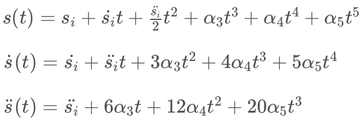
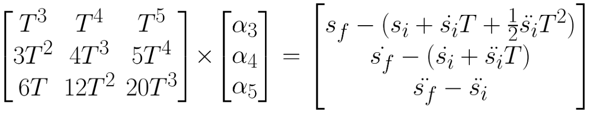
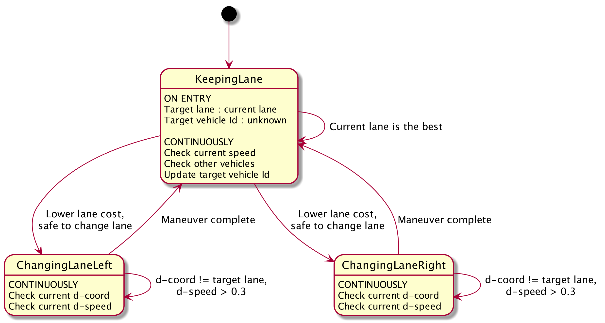

# Path Planning Project

The goals / steps of this project are the following:

* Implement the Path Planning algorithm in C++.
* Ensure that the project compiles.
* Test the Path Planner with the [simulator](https://github.com/udacity/self-driving-car-sim/releases).

## [Rubric](https://review.udacity.com/#!/rubrics/1020/view) Points
### Here I will consider the rubric points individually and describe how I addressed each point in my implementation.

---
### Compilation
#### 1. The code compiles correctly.

The code compiles without errors with cmake-3.9.0 and make-3.81 on macOS-10.12.6.

---
### Valid Trajectories
#### 1. The car is able to drive at least 4.32 miles without incident.

The car drove three laps (more than 13 miles) without an incident. See the recording below.

#### 2. The car drives according to the speed limit.

The speed limit is never exceeded. The car drives at a speed 5 mph below the posted speed limit unless there is slow traffic ahead.

#### 3. Max Acceleration and Jerk are not Exceeded.

The car does not exceed a total acceleration of 10 m/s^2 and a jerk of 10 m/s^3.

#### 4. Car does not have collisions.

The car does not come into contact with any of the other cars on the road.

#### 5. The car stays in its lane, except for the time between changing lanes.

Typically the car doesn't spend more than 2 seconds outside the lane lanes when changing lanes.

#### 6. The car is able to change lanes.

The car is able to smoothly change lanes when it makes sense to do so, such as when behind a slower moving car and an adjacent lane is clear of other traffic.

### Reflection
#### 1. There is a reflection on how to generate paths.

The class diagram of the solution: <p align="center"></p>

_**Path Planner**_

Implements the core functionality of Path Planner. It uses the Vehicle class, embeds Coordinate Converter and Trajectory Generator, and also aggregates Planner State. The only public method provided by this class is `Update`, which receives simulator data from the WebSocket server:
* Current s,d-coordinates, lane width, number of lanes on the road, and speed limit.
* Previous path x,y.
* Sensor fusion data.
* A control functor providing x,y-coordinates of the next planned points back to the simulator.

Path Planner uses Trajectory Generator to continuously generate a safe and feasible trajectory for the planning time of 2 seconds, and 50 points of the first second are passed to the simulator. Upon each update, Path Planner tries to reuse the unused portion of the planned trajectory, appending it with new points to maintain 50 points of the projected path. An exclusion is the cases of beginning to change lanes and following a vehicle ahead, then the previous planned points are discarded (except first 5 ones), and a new path is generated. Discarding previous points is needed to start a maneuver immediately, if safe. The first 5 points are always reused because the controls are delayed for about 100 ms, and the points are sampled every 20 ms.

Every 1 second, Path Planner dry-runs Trajectory Generator to predict the car's position in a second, and uses the prediction along with the current simulator data to determine the next state. The state machine and the state transition logic is implemented in the Path Planner family of state classes.

There are two modes of generating the trajectory: free run at comfortable speed and following the vehicle ahead. Free is run is just driving at a speed 5 mph below the posted speed limit. Following the vehicle ahead is implemented by aligning own speed to maintain a buffer time of 3 seconds behind the other vehicle. There are two issues, which prevent using the direct trajectory generation function for following other vehicle:
1) Coordinates of other vehicles are not precise, they're taken from the simulator, while the local coordinate system is computed off splines.
2) Simulation of other vehicles is imperfect: they drive erratically with extreme jerks when they're following other vehicles.

In this case, own speed is computed as a function of distance to other vehicle `x`, its speed `v`, and preferred buffer time `b`:

 

As shown on the example plot, the car maintains the target speed when following `b` seconds behind, gently accelerates when the distance increases, and decelerates when the distance decreases.

_**Vehicle**_

It's a simplistic class representing an other vehicle on the road derived from the sensor fusion data. It provides method `GetState` to predict the other vehicle's state at a given time.

_**Coordinate Converter**_

Used by Path Planner to convert sensor fusion data of other vehicles to Frenet states, and to convert predicted path points from Frenet to Cartesian coordinates. Coordinate Convertor interpolates s-x and s-d splines over adjacent map points points, which are spanning as far as 300 meters away from the car. The distance is chosen to exceed the sensor fusion range, which is typically observed up to 250 meters away. [tk::spline](http://kluge.in-chemnitz.de/opensource/spline/) interpolation library is used in this solution. 

_**Trajectory Generator**_

Provides two `Generate` methods to generate a free-running trajectory of a vehicle, as well as a trajectory of a vehicle following other vehicle. Trajectory Generator implements function `GetJmt` to compute a Jerk Minimizing Trajectory (JMT) by solving the system of equations for position, velocity, and acceleration:



These equations are solved in matrix form using solver `Eigen::ColPivHouseholderQR`:



Trajectory Generator uses normal distributions of s- and d-coordinate, speed, and acceleration to generate a number of perturbed goals, then using Trajectory Estimator to find a minimum cost trajectory.

_**Trajectory Estimator**_

Provides a single public method `GetCost` to compute the integral cost of a given trajectory. The class implements a number of trajectory cost functions of a different weight:

| Name          | Range | Weight | Description |
|:-------------:|:-----:|:----:|:-----------|
| TimeDiff      | 0..1  | 10   | Penalizes trajectories that span a duration which is longer or shorter than the duration requested |
| Sdiff         | 0..1  | 1    | Penalizes trajectories whose s-coordinate (and derivatives) differ from the goal | 
| Ddiff         | 0..1  | 10   | Penalizes trajectories whose d-coordinate (and derivatives) differ from the goal |
| Collision     | 0,1   | 1000 | Penalizes collisions |
| Buffer        | 0..1  | 100  | Penalizes getting close to other vehicles |
| OffRoad       | 0,1   | 1000 | Penalizes getting off-road |
| Speeding      | 0,1   | 1000 | Penalizes exceeding the speed limit |
| Efficiency    | -1..1 | 700  | Rewards high average speeds |
| MaxTotalAccel | 0,1   | 500  | Penalizes maximum sum of instant s- and d-acceleration |
| TotalAccel    | 0..1  | 500  | Penalizes sum of s- and d-acceleration over time |
| MaxJerk       | 0,1   | 500  | Penalizes maximum instant s-jerk |
| TotalJerk     | 0..1  | 500  | Penalizes s-jerk over time |

_**Planner State**_

This base class and derivatives implement the finite state machine of the Path Planner: <p align="center"></p>
Planner State an object-oriented State pattern with two methods:
* `GetState`: provides the state machine with a number of inputs necessary for making the decision about next state. If the decision is made to change the state, a new state object is returned by the method. The method caller is responsible to store the state object. If there's no state change, an NULL-pointer is returned, which is discarded by the method caller.
* `GetTarget`: provides the target vehicle Id and lane of the current state.

Planner State uses two cost functions to compute the cost of driving lanes:
* Lane number cost, range 0..1, weight 1: Rewards driving in a middle lane. Penalizes driving in a right lane a little bit more than a left lane. It forces the car to pass a slower vehicle ahead using a left lane if both side lanes are free.
* Lane speed cost, range -1..1, weight 10: Rewards driving in a free lane, a lane with a vehicle too far ahead, a lane with a vehicle ahead driving at a higher speed. 

The decision to change lanes is only made when it's safe to accomplish, i.e. there are no cars nearby in the target lane. Even though the state machine is currently implementing 3 states, it's easily scalable to more states, with each state perfectly incapsulated in its own class.

---
### Simulation

A recording of the final Path Planner (click to see the full footage):

[](https://youtu.be/AQDTm1KXMgM "Path Planning")

---
### Dependencies

* cmake >= 3.5
 * All OSes: [click here for installation instructions](https://cmake.org/install/)
* make >= 4.1
  * Linux: make is installed by default on most Linux distros
  * Mac: [install Xcode command line tools to get make](https://developer.apple.com/xcode/features/)
  * Windows: [Click here for installation instructions](http://gnuwin32.sourceforge.net/packages/make.htm)
* gcc/g++ >= 5.4
  * Linux: gcc / g++ is installed by default on most Linux distros
  * Mac: same deal as make - [install Xcode command line tools]((https://developer.apple.com/xcode/features/)
  * Windows: recommend using [MinGW](http://www.mingw.org/)
* [uWebSockets](https://github.com/uWebSockets/uWebSockets)
  * Run either `install-mac.sh` or `install-ubuntu.sh`.
  * If you install from source, checkout to commit `e94b6e1`, i.e.
    ```
    git clone https://github.com/uWebSockets/uWebSockets 
    cd uWebSockets
    git checkout e94b6e1
    ```

---
## Basic Build Instructions

1. Clone this repo.
2. Make a build directory: `mkdir build && cd build`
3. Compile: `cmake .. && make`
4. Run it: `./path_planning`.

The code is covered with some unit tests. The [Google Test](https://github.com/google/googletest) framework is used for that. To build and run the tests, enter the command in the build directory:
```
$ cmake -Dtest=ON .. && make && make test
-- Configuring done
-- Generating done
-- Build files have been written to: /Users/vernor/Documents/carnd/carnd_path_planning/build
[  8%] Built target trajectory_cost_lib
[ 16%] Built target helpers_lib
[ 24%] Built target vehicle_lib
[ 56%] Built target gtest
[ 64%] Built target test_trajectory_cost
[100%] Built target path_planning
Running tests...
Test project /Users/vernor/Documents/carnd/carnd_path_planning/build
    Start 1: test_trajectory_cost
1/1 Test #1: test_trajectory_cost .............   Passed    0.00 sec

100% tests passed, 0 tests failed out of 1

Total Test time (real) =   0.01 sec
```
